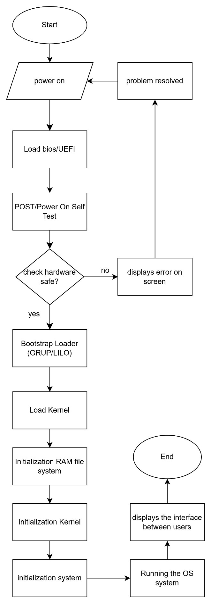

# TUGAS SISTEM OPERASI 

---

#### Dosen Pengampu :
**Dr. Ferry Astika Saputra ST, M.Sc**

#### Disusun oleh :
**Aldino Maytata Prandila**
**(3214521014)**
D3-LA IT-A

---

  

---

Step Explanation
1.	Start
---
2.	Turn on the computer by pressing the power button
---
3.	BIOS (Basic Input/Output System) or UEFI (Unified Extensible Firmware Interface) initializes the hardware and performs an initial check.
---
4.	Performing a series of diagnostic tests/POST (Power-On Self-Test) to check if all hardware components are functioning properly when the computer is powered on.
---
5.	If yes, proceed; if no, display an error. Once the issue is resolved, return to Step 2.
---
6.	BIOS/UEFI searches for the bootloader on the primary storage device (HDD/SSD) and executes it using GRUB/LILO.
---
7.	Loading the kernel/OS core.
---
8.	The system loads a temporary initial filesystem that contains drivers to continue the booting process.
---
9.	The kernel initializes all necessary hardware modules, subsystems, and drivers.
---
10.	Initializing the system to be used.
---
11.	Running the kernel/OS, which functions to coordinate hardware performance, run applications, and load them into main memory/operate the computer.
---
12.	Displaying the user interface and responding to user commands.
---
13.	Computer is ready to use.
---
14.	End.
