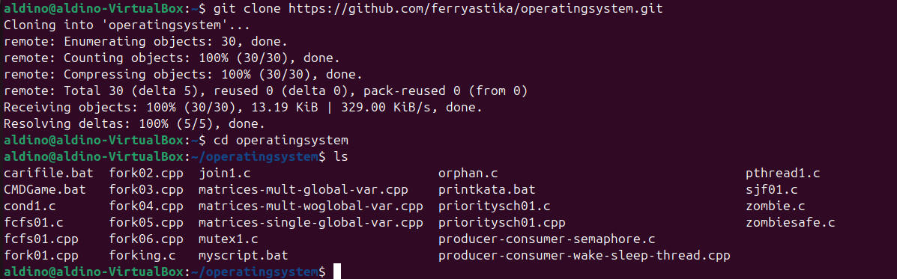

# TUGAS SISTEM OPERASI 

---

#### Dosen Pengampu :
**Dr. Ferry Astika Saputra ST, M.Sc**

#### Disusun oleh :
**Aldino Maytata Prandila**
**(3214521014)**
D3-LA IT-A

---
 

#TUGAS
>Deskripsikan dan visualisasikan pohon proses hasil eksekusi dari kode program
         fork01.c, fork02.c, fork03.c, fork04.c, fork05.c dan fork06.c.

---
 

Akses dan clonning repo : https://github.com/ferryastika/operatingsystem.git

---
 
