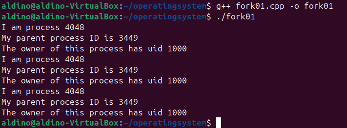
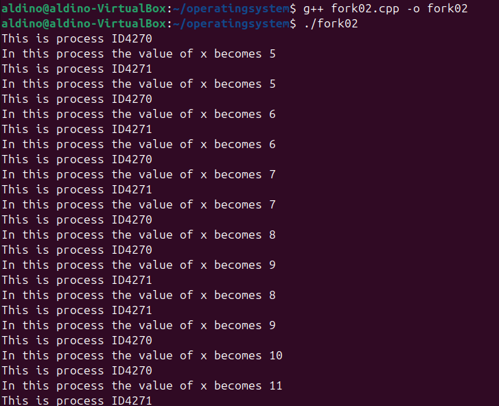
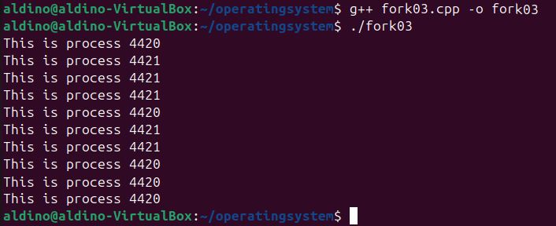
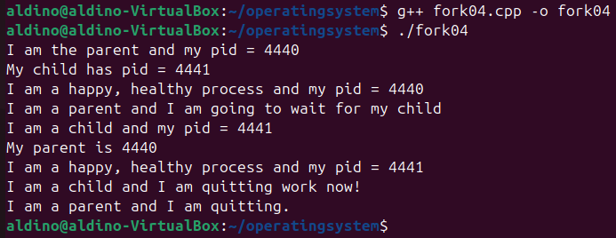
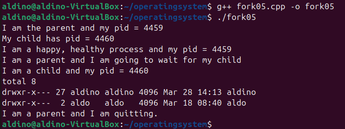
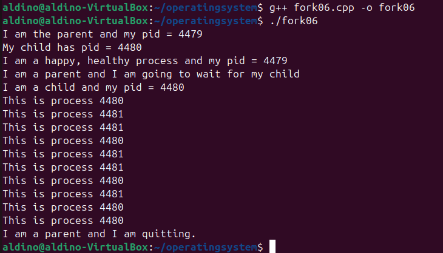

# TUGAS SISTEM OPERASI 

---

#### Dosen Pengampu :
**Dr. Ferry Astika Saputra ST, M.Sc**

#### Disusun oleh :
**Aldino Maytata Prandila**
**(3214521014)**
D3-LA IT-A

---

# TUGAS
### Deskripsikan dan visualisasikan pohon proses hasil eksekusi dari kode program
         fork01.c, fork02.c, fork03.c, fork04.c, fork05.c dan fork06.c.

---

clonning repo : https://github.com/ferryastika/operatingsystem.git

---

### 1. fork01 

•visualisasi pohon proses

         pid: 4048, ppid: 3449
         [sebagai main process]

•description

         Program fork01 menjalankan fork(), menghasilkan proses anak dengan PID 4048, 
         yang berasal dari proses induk dengan PPID 3449. Karena fork() dipanggil beberapa kali, 
         beberapa proses anak tercipta. Semua proses dimiliki oleh pengguna dengan UID 1000.

---

### 2. fork02 

•visualisasi pohon proses

         pid: 4270, ppid: 3449
         [Parent Process]
            |
            +--> fork() memunculkan child process
            |
            +--> pid: 4271, ppid: 4270
                 [Child Process]
         
•description

         1. Proses utama (pid: 4270) dijalankan pertama kali.

         2. fork() dipanggil, yang menyebabkan sistem menciptakan proses anak (pid: 4271).

         3. Kedua proses (induk & anak) memiliki variabel x, tetapi nilainya tidak dibagikan karena proses berjalan di  memori terpisah.

         4. Kedua proses menjalankan loop while (1), sehingga mereka terus mencetak PID dan nilai x masing-masing.

         5. Terlihat dua PID berbeda (4270 dan 4271) yang mencetak angka yang sama secara bergantian, karena mereka berjalan bersamaan.

---

### 3. fork03 

•visualisasi pohon proses

         pid: 4420, ppid: 3449
         [Parent Process]
                     |
         fork() memunculkan child process
                     |
             pid: 4421, ppid: 4420
                 [Child Process]

•description

         1. Proses utama (pid: 4420) pertama kali dijalankan.

         2. fork() membuat proses anak (pid: 4421).

         3. Kedua proses menjalankan perulangan dan mencetak "This is process 4420" dan "This is process 4421" secara bergantian.

         4. Karena sistem multitasking, urutan eksekusi tidak selalu teratur, sehingga output terlihat bergantian antara dua proses.
         
---

### 4. fork04 

•visualisasi pohon proses

•description       
         
---

### 5. fork05 

•visualisasi pohon proses

•description

---

### 6. fork06 

•visualisasi pohon proses

•description

---
