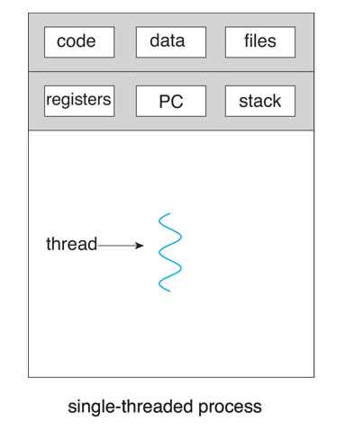
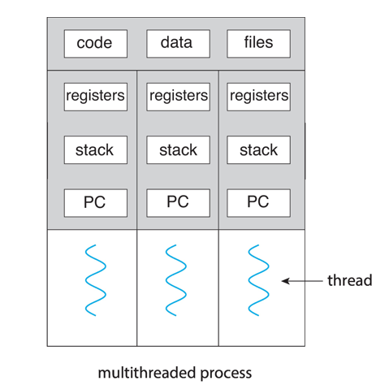

# TUGAS SISTEM OPERASI 

---

#### Dosen Pengampu :
**Dr. Ferry Astika Saputra ST, M.Sc**

#### Disusun oleh :
**Aldino Maytata Prandila**
**(3214521014)**
D3-LA IT-A

---

# Single Thread

- Gambar

- penjelasan
  
    Single Thread adalah model eksekusi yang ada dalam suatu cores di mana proses berjalan secara berurutan (sequential) dalam satu alur kerja(thread). konsep kerja single thread ini mirip seperti antrian yaitu jika satu tugas membutuhkan waktu lama, maka tugas-tugas lain harus menunggu hingga tugas tersebut selesai. Kelebihan dari Model ini adalah kesederhanaan dan mudah diimplementasikan serta jarang terjadi error, tetapi kurang efisien untuk aplikasi yang memerlukan banyak proses secara bersamaan.
  
# Multi Thread

- gambar

- penjelasan

  Multithread adalah suatu program yang memungkinkan menjalankan beberapa thread sekaligus secara paralel. Setiap thread bisa menjalankan tugas yang berbeda secara bersamaan, sehingga meningkatkan efisiensi dan responsivitas aplikasi. Konsep ini sangat berguna pada aplikasi zaman sekarang seperti game, server, atau software multimedia, di mana penggunaan hal itu menggunakan banyak proses berjalan secara bersamaan—misalnya satu thread untuk input pengguna, satu untuk rendering grafis, dan lainnya untuk memproses logika program
