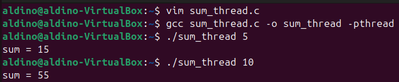
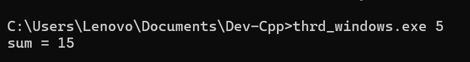

# TUGAS SISTEM OPERASI 

---

#### Dosen Pengampu :
**Dr. Ferry Astika Saputra ST, M.Sc**

#### Disusun oleh :
**Aldino Maytata Prandila**
**(3214521014)**
D3-LA IT-A

---

# TUGAS
### Kerjakan Programming Exercise 
    a. Penerapan thread pada contoh SumTask.java 
    b. penerapan Thread di Linux (thrd-posix.c) dan 
    c. penerapan thread di Microsoft Windows (thrd-win32.c).
    Beri penjelasan dalam bentuk esay. 
    Gunakan Link https://github.com/ferryastika/osc10e/tree/master/ch4

---

a. Penerapan thread pada contoh SumTask.java 

- Code

       import java.util.concurrent.*;

      public class SumTask extends RecursiveTask<Integer>
      {
        static final int SIZE = 10000;
      static final int THRESHOLD = 1000;

      private int begin;
      private int end;
      private int[] array;

      public SumTask(int begin, int end, int[] array) {
          this.begin = begin;
          this.end = end;
          this.array = array;
      }
  
      protected Integer compute() {
          if (end - begin < THRESHOLD) {
              // conquer stage 
              int sum = 0;
              for (int i = begin; i <= end; i++)
                  sum += array[i];

            return sum;
        }
        else {
            // divide stage 
            int mid = begin + (end - begin) / 2;
            
            SumTask leftTask = new SumTask(begin, mid, array);
            SumTask rightTask = new SumTask(mid + 1, end, array);

            leftTask.fork();
            rightTask.fork();

            return rightTask.join() + leftTask.join();
        }
        }
    
    	public static void main(String[] args) {
    		ForkJoinPool pool = new ForkJoinPool();
    		int[] array = new int[SIZE];

		// create SIZE random integers between 0 and 9
		java.util.Random rand = new java.util.Random();

		for (int i = 0; i < SIZE; i++) {
			array[i] = rand.nextInt(10);
		}		
		
		// use fork-join parallelism to sum the array
		SumTask task = new SumTask(0, SIZE-1, array);

		int sum = pool.invoke(task);

		System.out.println("The sum is " + sum);
	  }
      }
- Output 

    

- Penjelasan essay

  Penerapan thread pada SumTask.java menggunakan konsep Fork/Join Framework di Java, yang secara khusus dirancang untuk menyelesaikan tugas-tugas besar yang bisa dipecah (divide) menjadi tugas-tugas kecil, dan dijalankan secara paralel (conquer). Pada program ini, SumTask merupakan turunan dari RecursiveTask<Integer> yang memungkinkan kita menghitung jumlah elemen dari sebuah array besar secara efisien menggunakan banyak thread.

  Ketika ukuran bagian array yang akan dihitung lebih kecil dari ambang batas (THRESHOLD), tugas akan langsung dihitung secara sekuensial. Namun jika lebih besar, maka tugas akan dibagi dua, dan masing-masing akan diproses dalam thread terpisah menggunakan fork(). Setelah kedua sub-task selesai, hasilnya digabung menggunakan join(). Dengan menggunakan ForkJoinPool, seluruh proses pembagian dan penggabungan dikelola secara otomatis, sehingga thread dapat berjalan secara paralel untuk meningkatkan performa komputasi.

---

b. penerapan Thread di Linux (thrd-posix.c)

- Code

			#include <pthread.h>
		#include <stdio.h>
		#include <stdlib.h>
		#include <string.h>
		
		int sum; /* this data is shared by the thread(s) */
		
		void *runner(void *param); /* the thread */
		
		int main(int argc, char *argv[])
		{
		    pthread_t tid; /* the thread identifier */
		    pthread_attr_t attr; /* set of attributes for the thread */
		
		    if (argc != 2) {
		        fprintf(stderr, "usage: a.out <integer value>\n");
		        return -1;
		    }
		
		    if (atoi(argv[1]) < 0) {
		        fprintf(stderr, "Argument %d must be non-negative\n", atoi(argv[1]));
		        return -1;
		    }
		
		    /* get the default attributes */
		    pthread_attr_init(&attr);
		
		    /* allocate memory and copy the argument safely */
		    char *arg = malloc(strlen(argv[1]) + 1); // +1 untuk null terminator
		    if (arg == NULL) {
		        perror("malloc failed");
		        return -1;
		    }
		    strcpy(arg, argv[1]);
		
		    /* create the thread */
		    pthread_create(&tid, &attr, runner, arg);
		
		    /* now wait for the thread to exit */
		    pthread_join(tid, NULL);
		
		    printf("sum = %d\n", sum);
		    return 0;
		}
		
		/**
		 * The thread will begin control in this function
		 */
		void *runner(void *param)
		{
		    int i, upper = atoi((char *)param);
		    sum = 0;
		
		    if (upper > 0) {
		        for (i = 1; i <= upper; i++)
		            sum += i;
		    }
		
		    free(param); // penting! jangan lupa membebaskan memori
		    pthread_exit(0);
		}

  
- Output

  
- Penjelasan essay

Pada kode thrd-posix.c, penerapan thread dilakukan dengan menggunakan pustaka pthread, yang merupakan standar POSIX untuk pemrograman multithreading di sistem operasi berbasis Unix/Linux. Program ini membuat satu thread baru yang akan menjalankan fungsi runner, di mana ia menghitung jumlah dari angka 1 hingga nilai yang diberikan sebagai argumen program.

Fungsi utama (main) mengatur atribut thread menggunakan pthread_attr_init, lalu membuat thread dengan pthread_create. Data parameter disalin secara aman ke memori heap agar bisa diakses oleh thread, dan dibebaskan kembali di akhir fungsi runner dengan free(). Setelah thread selesai, pthread_join dipanggil untuk menunggu thread selesai sebelum program utama mencetak hasil. Pendekatan ini mencerminkan pemanfaatan thread untuk menjalankan proses secara independen dari main thread namun tetap terkendali.

---

c. penerapan thread di Microsoft Windows (thrd-win32.c)

- Code

		#include <stdio.h>
		#include <stdlib.h>
		#include <windows.h>
		
		DWORD Sum = 0; // data is shared by the thread
		
		// thread function
		DWORD WINAPI Summation(LPVOID Param)
		{
		    int upper = *((int*)Param);
		    int i;
		
		    for (i = 1; i <= upper; i++) {
		        Sum += i;
		    }
		
		    return 0;
		}
		
		int main(int argc, char *argv[])
		{
		    DWORD ThreadId;
		    HANDLE ThreadHandle;
		    int Param;
		
		    if (argc != 2) {
		        fprintf(stderr, "An integer parameter is required\n");
		        return -1;
		    }
		
		    Param = atoi(argv[1]);
		
		    if (Param < 0) {
		        fprintf(stderr, "An integer >= 0 is required\n");
		        return -1;
		    }
		
		    // create the thread
		    ThreadHandle = CreateThread(
		        NULL,             // default security attributes
		        0,                // default stack size
		        Summation,        // thread function
		        &Param,           // parameter to thread function
		        0,                // default creation flags
		        &ThreadId         // returns the thread identifier
		    );
		
		    if (ThreadHandle == NULL) {
		        fprintf(stderr, "Error creating thread\n");
		        return -1;
		    }
		
		    // wait for thread to finish
		    WaitForSingleObject(ThreadHandle, INFINITE);
		    CloseHandle(ThreadHandle);
		
		    printf("sum = %lu\n", Sum);
		
		    return 0;
			}

  
- Output

- Penjelasan essay

Meskipun judulnya thrd-win32.c, kode ini sebenarnya masih menggunakan pustaka pthread, sehingga dapat berjalan di Windows asalkan pustaka pthread terinstal atau digunakan melalui tools seperti MinGW atau Cygwin. Fungsionalitasnya identik dengan versi Linux: membuat thread untuk menjalankan fungsi runner yang menghitung jumlah dari 1 hingga nilai yang diberikan.

Sama seperti sebelumnya, parameter disalin secara eksplisit menggunakan malloc dan strcpy, thread dijalankan menggunakan pthread_create, dan setelah selesai diproses, thread ditunggu dengan pthread_join. Pendekatan ini menunjukkan bahwa meskipun berada di platform berbeda, pemrograman multithread dapat dilakukan dengan cara yang serupa jika menggunakan pustaka portable seperti POSIX thread.

---

- Penjelasan tambahan

  Penerapan multithreading seperti ini sangat penting dalam aplikasi yang memerlukan efisiensi waktu, seperti pemrosesan data besar, simulasi, atau layanan jaringan. Dengan pemisahan tugas ke thread-thread kecil, pekerjaan dapat diselesaikan lebih cepat dan efisien.
  
