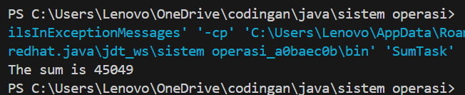

# TUGAS SISTEM OPERASI 

---

#### Dosen Pengampu :
**Dr. Ferry Astika Saputra ST, M.Sc**

#### Disusun oleh :
**Aldino Maytata Prandila**
**(3214521014)**
D3-LA IT-A

---

# TUGAS
### Kerjakan Programming Exercise 
    a. Penerapan thread pada contoh SumTask.java 
    b. penerapan Thread di Linux (thrd-posix.c) dan 
    c. penerapan thread di Microsoft Windows (thrd-win32.c).
    Beri penjelasan dalam bentuk esay. 
    Gunakan Link https://github.com/ferryastika/osc10e/tree/master/ch4

---

a. Penerapan thread pada contoh SumTask.java 

- Code

       import java.util.concurrent.*;

      public class SumTask extends RecursiveTask<Integer>
      {
        static final int SIZE = 10000;
      static final int THRESHOLD = 1000;

      private int begin;
      private int end;
      private int[] array;

      public SumTask(int begin, int end, int[] array) {
          this.begin = begin;
          this.end = end;
          this.array = array;
      }
  
      protected Integer compute() {
          if (end - begin < THRESHOLD) {
              // conquer stage 
              int sum = 0;
              for (int i = begin; i <= end; i++)
                  sum += array[i];

            return sum;
        }
        else {
            // divide stage 
            int mid = begin + (end - begin) / 2;
            
            SumTask leftTask = new SumTask(begin, mid, array);
            SumTask rightTask = new SumTask(mid + 1, end, array);

            leftTask.fork();
            rightTask.fork();

            return rightTask.join() + leftTask.join();
        }
        }
    
    	public static void main(String[] args) {
    		ForkJoinPool pool = new ForkJoinPool();
    		int[] array = new int[SIZE];

		// create SIZE random integers between 0 and 9
		java.util.Random rand = new java.util.Random();

		for (int i = 0; i < SIZE; i++) {
			array[i] = rand.nextInt(10);
		}		
		
		// use fork-join parallelism to sum the array
		SumTask task = new SumTask(0, SIZE-1, array);

		int sum = pool.invoke(task);

		System.out.println("The sum is " + sum);
	  }
      }
- Output 

    

- Penjelasan essay

  Penerapan thread pada SumTask.java menggunakan konsep Fork/Join Framework di Java, yang secara khusus dirancang untuk menyelesaikan tugas-tugas besar yang bisa dipecah (divide) menjadi tugas-tugas kecil, dan dijalankan secara paralel (conquer). Pada program ini, SumTask merupakan turunan dari RecursiveTask<Integer> yang memungkinkan kita menghitung jumlah elemen dari sebuah array besar secara efisien menggunakan banyak thread.

  Ketika ukuran bagian array yang akan dihitung lebih kecil dari ambang batas (THRESHOLD), tugas akan langsung dihitung secara sekuensial. Namun jika lebih besar, maka tugas akan dibagi dua, dan masing-masing akan diproses dalam thread terpisah menggunakan fork(). Setelah kedua sub-task selesai, hasilnya digabung menggunakan join(). Dengan menggunakan ForkJoinPool, seluruh proses pembagian dan penggabungan dikelola secara otomatis, sehingga thread dapat berjalan secara paralel untuk meningkatkan performa komputasi.

